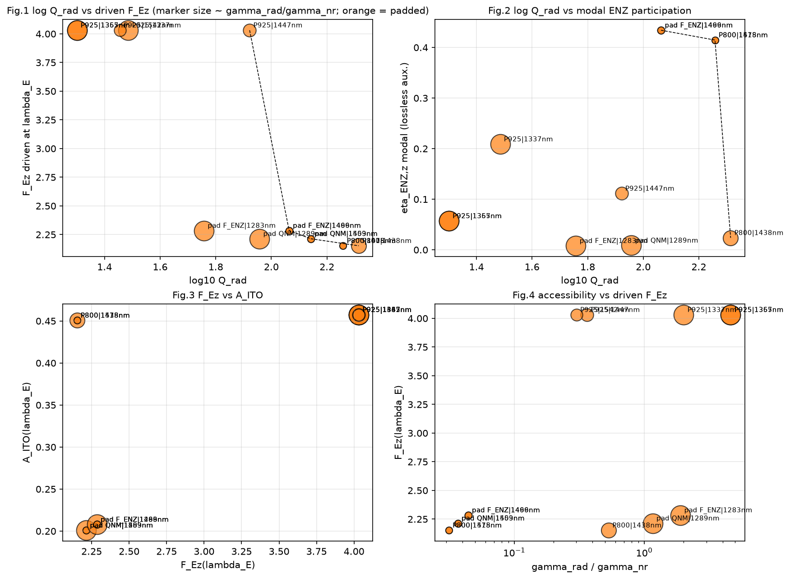
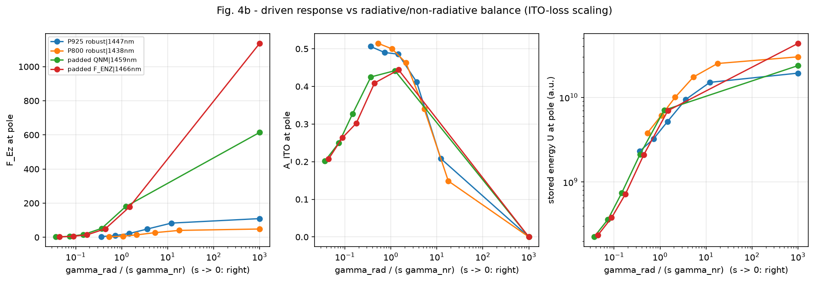
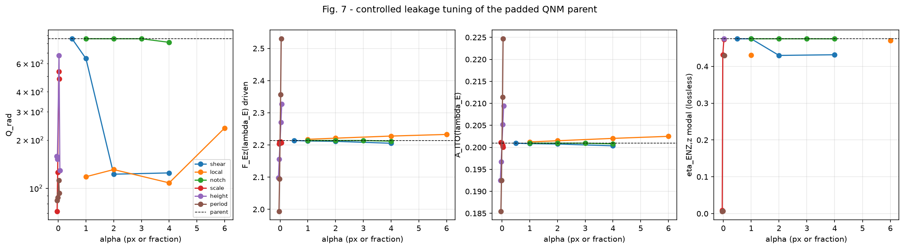
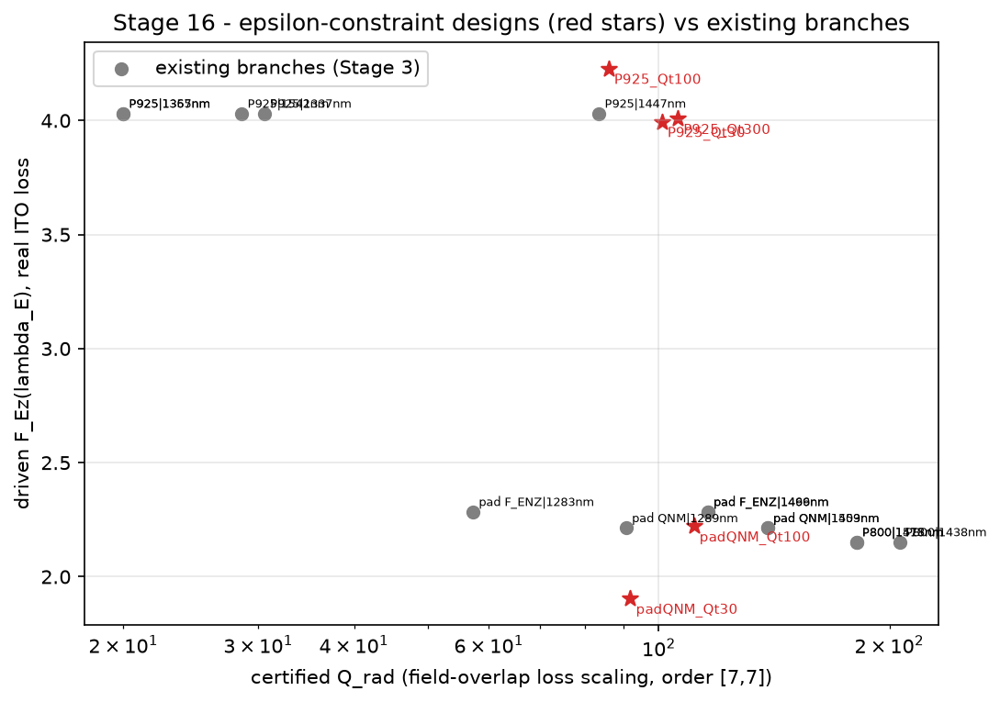

# HIGH-Q + HIGH-DRIVEN-Ez / ENZ PHYSICS AUDIT - REPORT

Generated by `stage15_report.py` from `outputs/*.json|csv` (all numbers reproducible from the stage scripts).

## Conventions (measured facts)

- Common harness: TORCWA complex128, order [7, 7], lambda_E = 1433.488 nm, lab-x polarization, |E_inc| = 1; A = 1 - R_total - T_total (all orders); F_Ez = <|Ez/E_inc|^2>_ITO; eta_z = int|Ez|^2/int|E|^2 (ITO); modal proxies from the driven field at the pole of the lossless-ITO auxiliary structure (eta_ENZ,z = int_ITO|Ez|^2 / U, U = stored energy incl. dispersive ITO term, claddings without the (0,0) harmonic).
- Loss scaling s in [1.0, 0.5, 0.25, 0.1, 0.03, 0.0] on Im eps_ITO; gamma(s) = gamma_rad + s gamma_nr fitted on the field-overlap-tracked branch; poles accepted only if found in both r and t (AAA), damped, with significant Lorentzian peak fraction; high-Q poles re-fitted on a dense local rescan.
- No fliplr symmetry projection anywhere; frozen geometries read-only (SHA256 in `outputs/manifest.json`).

## 1. Pole reconnaissance and loss-scaling decomposition (Stage 2, measured)

**padded QNM** (P = 850, h = 140): significant s=1 poles: 1206.2 nm (Q 56.8), 1289.0 nm (Q 48.6), 1458.7 nm (Q 5.0), 1503.0 nm (Q 5.8)
  - branch padded QNM|1289nm: s=1: 1289.0/Q48.6 -> s=0.5: 1289.4/Q63.5 -> s=0.25: 1289.6/Q74.7 -> s=0.1: 1289.8/Q83.5 -> s=0.03: 1289.9/Q88.2 -> s=0: 1289.9/Q90.3; fit Q_rad = 90.7, Q_nr = 105.17, gamma_rad/gamma_nr = 1.1600, linearity residual 0.002, lossless-aux Q = 90.3 (* = overlap/continuity flag)
  - branch padded QNM|1459nm: s=1: 1485.9/Q4.9 -> s=0.5: 1513.9/Q9.9* -> s=0.25: 1513.6/Q18.4 -> s=0.1: 1513.6/Q36.0 -> s=0.03: 1513.6/Q65.7 -> s=0: 1513.1/Q144.4*; fit Q_rad = 138.6, Q_nr = 5.10, gamma_rad/gamma_nr = 0.0368, linearity residual 0.014, lossless-aux Q = n/a (* = overlap/continuity flag)
  - branch padded QNM|1503nm: s=1: 1485.9/Q4.9 -> s=0.5: 1513.9/Q9.9* -> s=0.25: 1513.6/Q18.4 -> s=0.1: 1513.6/Q36.0 -> s=0.03: 1513.6/Q65.7 -> s=0: 1513.1/Q144.4*; fit Q_rad = 138.6, Q_nr = 5.10, gamma_rad/gamma_nr = 0.0368, linearity residual 0.014, lossless-aux Q = n/a (* = overlap/continuity flag)
**padded F_ENZ** (P = 850, h = 140): significant s=1 poles: 1205.8 nm (Q 59.3), 1283.3 nm (Q 37.4), 1465.7 nm (Q 5.2), 1498.9 nm (Q 5.8)
  - branch padded F_ENZ|1283nm: s=1: 1283.3/Q37.4 -> s=0.5: 1283.9/Q45.4 -> s=0.25: 1284.2/Q50.7 -> s=0.1: 1284.4/Q54.3 -> s=0.03: 1284.5/Q56.2 -> s=0: 1284.5/Q57.0; fit Q_rad = 57.2, Q_nr = 108.64, gamma_rad/gamma_nr = 1.8989, linearity residual 0.003, lossless-aux Q = 57.0 (* = overlap/continuity flag)
  - branch padded F_ENZ|1466nm: s=1: 1488.6/Q4.9 -> s=0.5: 1509.0/Q9.4 -> s=0.25: 1529.3/Q20.1* -> s=0.1: 1520.9/Q35.1 -> s=0.03: 1517.6/Q65.5 -> s=0: 1518.1/Q110.3; fit Q_rad = 115.9, Q_nr = 5.13, gamma_rad/gamma_nr = 0.0442, linearity residual 0.005, lossless-aux Q = 110.3 (* = overlap/continuity flag)
  - branch padded F_ENZ|1499nm: s=1: 1488.6/Q4.9 -> s=0.5: 1509.0/Q9.4 -> s=0.25: 1529.3/Q20.1* -> s=0.1: 1520.9/Q35.1 -> s=0.03: 1517.6/Q65.5 -> s=0: 1518.1/Q110.3; fit Q_rad = 115.9, Q_nr = 5.13, gamma_rad/gamma_nr = 0.0442, linearity residual 0.005, lossless-aux Q = 110.3 (* = overlap/continuity flag)
**P800 robust** (P = 800, h = 200): significant s=1 poles: 1207.6 nm (Q 17.5), 1437.6 nm (Q 73.8), 1477.5 nm (Q 5.2), 1515.4 nm (Q 5.8)
  - branch P800 robust|1438nm: s=1: 1437.6/Q73.8 -> s=0.5: 1436.7/Q99.9 -> s=0.25: 1436.1/Q132.4 -> s=0.1: 1436.0/Q173.9 -> s=0.03: 1436.0/Q206.0 -> s=0: 1436.0/Q223.8; fit Q_rad = 206.2, Q_nr = 109.82, gamma_rad/gamma_nr = 0.5325, linearity residual 0.045, lossless-aux Q = 223.8 (* = overlap/continuity flag)
  - branch P800 robust|1478nm: s=1: 1499.8/Q5.5 -> s=0.5: 1530.3/Q10.6* -> s=0.25: 1535.1/Q20.5 -> s=0.1: 1536.1/Q42.9 -> s=0.03: 1535.2/Q90.5 -> s=0: 1533.4/Q138.6; fit Q_rad = 181.1, Q_nr = 5.70, gamma_rad/gamma_nr = 0.0314, linearity residual 0.009, lossless-aux Q = 138.6 (* = overlap/continuity flag)
  - branch P800 robust|1515nm: s=1: 1499.8/Q5.5 -> s=0.5: 1530.3/Q10.6* -> s=0.25: 1535.1/Q20.5 -> s=0.1: 1536.1/Q42.9 -> s=0.03: 1535.2/Q90.5 -> s=0: 1533.4/Q138.6; fit Q_rad = 181.1, Q_nr = 5.70, gamma_rad/gamma_nr = 0.0314, linearity residual 0.009, lossless-aux Q = 138.6 (* = overlap/continuity flag)
**P925 robust** (P = 925, h = 240): significant s=1 poles: 1337.0 nm (Q 27.3), 1357.3 nm (Q 13.7), 1364.8 nm (Q 16.6), 1446.9 nm (Q 23.0), 1542.0 nm (Q 6.6)
  - branch P925 robust|1337nm: s=1: 1338.4/Q25.4 -> s=0.5: 1340.8/Q17.2 -> s=0.25: 1338.7/Q23.8 -> s=0.1: 1334.4/Q30.8 -> s=0.03: 1333.2/Q35.6 -> s=0: 1333.0/Q37.6; fit Q_rad = 30.6, Q_nr = 61.44, gamma_rad/gamma_nr = 2.0105, linearity residual 0.297, lossless-aux Q = 37.6 (* = overlap/continuity flag)
  - branch P925 robust|1357nm: s=1: 1365.1/Q16.8 -> s=0.5: 1363.2/Q17.4 -> s=0.25: 1364.3/Q18.7 -> s=0.1: 1364.9/Q19.6 -> s=0.03: 1365.3/Q20.1 -> s=0: 1365.5/Q20.3; fit Q_rad = 20.0, Q_nr = 92.26, gamma_rad/gamma_nr = 4.6156, linearity residual 0.033, lossless-aux Q = 20.3 (* = overlap/continuity flag)
  - branch P925 robust|1365nm: s=1: 1365.1/Q16.8 -> s=0.5: 1363.2/Q17.4 -> s=0.25: 1364.3/Q18.7 -> s=0.1: 1364.9/Q19.6 -> s=0.03: 1365.3/Q20.1 -> s=0: 1365.5/Q20.3; fit Q_rad = 20.0, Q_nr = 92.26, gamma_rad/gamma_nr = 4.6156, linearity residual 0.033, lossless-aux Q = 20.3 (* = overlap/continuity flag)
  - branch P925 robust|1447nm: s=1: 1446.9/Q23.0 -> s=0.5: 1440.2/Q32.6 -> s=0.25: 1438.0/Q46.4 -> s=0.1: 1437.7/Q66.3 -> s=0.03: 1437.9/Q83.8 -> s=0: 1438.1/Q94.2; fit Q_rad = 83.5, Q_nr = 30.33, gamma_rad/gamma_nr = 0.3631, linearity residual 0.055, lossless-aux Q = 94.2 (* = overlap/continuity flag)
  - branch P925 robust|1542nm: s=1: 1544.6/Q6.6 -> s=0.5: 1561.2/Q10.4 -> s=0.25: 1565.2/Q20.0* -> s=0.1: 1558.6/Q22.1 -> s=0.03: 1549.9/Q25.5 -> s=0: 1553.3/Q37.5*; fit Q_rad = 28.6, Q_nr = 8.59, gamma_rad/gamma_nr = 0.3009, linearity residual 0.014, lossless-aux Q = n/a (* = overlap/continuity flag)
- Historical Stage-A (padded QNM winner): Q_loaded 4.90, Q_rad 1872, Q_nr 4.94, ratio 0.0026 (10-nm scan, nearest-continuation tracking) - compare with the field-overlap-tracked branches above.
- Historical Stage-A (padded F_ENZ winner): Q_loaded 4.90, Q_rad 106, Q_nr 5.14, ratio 0.0484 (10-nm scan, nearest-continuation tracking) - compare with the field-overlap-tracked branches above.

## 2. Driven vs modal (Stage 3, measured/derived)

See `outputs/stage3_branches_table.csv`; key rows:

| branch | lambda_pole | Q_loaded | Q_rad | Q_nr | g_rad/g_nr | eta_ENZ,z modal | eta_z modal | F_Ez(lamE) | F_Ez(pole) | A(lamE) | A(pole) |
|---|---|---|---|---|---|---|---|---|---|---|---|
| padded QNM|1289nm | 1289.0 | 48.62 | 90.7 | 105.17 | 1.1600 | 0.0086 | 0.221 | 2.214 | 1.484 | 0.201 | 0.467 |
| padded QNM|1459nm | 1485.9 | 4.90 | 138.6 | 5.10 | 0.0368 | 0.4241 | 0.963 | 2.214 | 2.038 | 0.201 | 0.202 |
| padded QNM|1503nm | 1485.9 | 4.90 | 138.6 | 5.10 | 0.0368 | 0.4241 | 0.963 | 2.214 | 2.038 | 0.201 | 0.202 |
| padded F_ENZ|1283nm | 1283.3 | 37.41 | 57.2 | 108.64 | 1.8989 | 0.0080 | 0.205 | 2.285 | 1.197 | 0.208 | 0.421 |
| padded F_ENZ|1466nm | 1488.6 | 4.90 | 115.9 | 5.13 | 0.0442 | 0.4341 | 0.930 | 2.285 | 2.081 | 0.208 | 0.207 |
| padded F_ENZ|1499nm | 1488.6 | 4.90 | 115.9 | 5.13 | 0.0442 | 0.4341 | 0.930 | 2.285 | 2.081 | 0.208 | 0.207 |
| P800 robust|1438nm | 1437.6 | 73.81 | 206.2 | 109.82 | 0.5325 | 0.0237 | 0.579 | 2.152 | 2.415 | 0.451 | 0.514 |
| P800 robust|1478nm | 1499.8 | 5.51 | 181.1 | 5.70 | 0.0314 | 0.4147 | 0.956 | 2.152 | 2.073 | 0.451 | 0.214 |
| P800 robust|1515nm | 1499.8 | 5.51 | 181.1 | 5.70 | 0.0314 | 0.4147 | 0.956 | 2.152 | 2.073 | 0.451 | 0.214 |
| P925 robust|1337nm | 1338.4 | 25.38 | 30.6 | 61.44 | 2.0105 | 0.2089 | 0.960 | 4.031 | 5.726 | 0.457 | 0.455 |
| P925 robust|1357nm | 1365.1 | 16.75 | 20.0 | 92.26 | 4.6156 | 0.0570 | 0.690 | 4.031 | 4.444 | 0.457 | 0.431 |
| P925 robust|1365nm | 1365.1 | 16.75 | 20.0 | 92.26 | 4.6156 | 0.0570 | 0.690 | 4.031 | 4.444 | 0.457 | 0.431 |
| P925 robust|1447nm | 1446.9 | 23.03 | 83.5 | 30.33 | 0.3631 | 0.1113 | 0.855 | 4.031 | 4.304 | 0.457 | 0.506 |
| P925 robust|1542nm | 1544.6 | 6.64 | 28.6 | 8.59 | 0.3009 | 0.3537 | 0.945 | 4.031 | 3.003 | 0.457 | 0.323 |

## 3. Pareto analysis (Stage 4)

- highest-Q Ez-rich parent: P800 robust|1438nm; strongest driven Ez: P925 robust|1447nm; best accessible high-Q (Q_rad >= 100): P800 robust|1438nm; Pareto knee (log Q_rad vs F_Ez): P925 robust|1447nm.
- 'high' defined from the data: Q_rad >= max(100, 75th percentile = 139); 'strong' F_Ez >= 1.5 x historical 2.2 = 3.3. Candidates in that upper-right region: NONE.
- Fronts: logQrad_vs_FEz_lambdaE: ['padded QNM|1459nm', 'padded QNM|1503nm', 'padded F_ENZ|1466nm', 'padded F_ENZ|1499nm', 'P800 robust|1438nm', 'P925 robust|1447nm']; logQrad_vs_FEz_pole: ['P800 robust|1438nm', 'P925 robust|1337nm', 'P925 robust|1447nm']; logQrad_vs_etaENZ_modal: ['padded QNM|1459nm', 'padded QNM|1503nm', 'padded F_ENZ|1466nm', 'padded F_ENZ|1499nm', 'P800 robust|1438nm', 'P800 robust|1478nm', 'P800 robust|1515nm']; FEz_vs_A_lambdaE: ['P925 robust|1337nm', 'P925 robust|1357nm', 'P925 robust|1365nm', 'P925 robust|1447nm', 'P925 robust|1542nm']

## 4. Angular behaviour (Stage 5)

- bare ITO: (0,0) A=0.045 F_Ez=0.00 eta_z=0.00, (10,0) A=0.051 F_Ez=0.08 eta_z=0.12, (20,0) A=0.067 F_Ez=0.31 eta_z=0.35, (30,0) A=0.094 F_Ez=0.62 eta_z=0.54, (40,0) A=0.127 F_Ez=0.92 eta_z=0.67, (10,45) A=0.048 F_Ez=0.04 eta_z=0.06, (20,45) A=0.056 F_Ez=0.15 eta_z=0.20, (30,45) A=0.067 F_Ez=0.27 eta_z=0.32, (40,45) A=0.077 F_Ez=0.34 eta_z=0.41, (10,90) A=0.045 F_Ez=0.00 eta_z=0.00, (20,90) A=0.046 F_Ez=0.00 eta_z=0.00, (30,90) A=0.047 F_Ez=0.00 eta_z=0.00, (40,90) A=0.048 F_Ez=0.00 eta_z=0.00
- EDR cuboid: (0,0) A=0.199 F_Ez=2.15 eta_z=0.76, (10,0) A=0.221 F_Ez=2.44 eta_z=0.79, (20,0) A=0.189 F_Ez=1.90 eta_z=0.76, (30,0) A=0.179 F_Ez=1.62 eta_z=0.74, (40,0) A=0.188 F_Ez=1.53 eta_z=0.75, (10,45) A=0.220 F_Ez=2.37 eta_z=0.77, (20,45) A=0.276 F_Ez=2.14 eta_z=0.58, (30,45) A=0.179 F_Ez=1.53 eta_z=0.70, (40,45) A=0.160 F_Ez=1.19 eta_z=0.68, (10,90) A=0.236 F_Ez=2.44 eta_z=0.74, (20,90) A=0.141 F_Ez=1.10 eta_z=0.59, (30,90) A=0.127 F_Ez=0.91 eta_z=0.59, (40,90) A=0.116 F_Ez=0.71 eta_z=0.56
- unpadded QNM: (0,0) A=0.205 F_Ez=2.32 eta_z=0.80, (10,0) A=0.233 F_Ez=2.70 eta_z=0.83, (20,0) A=0.179 F_Ez=1.83 eta_z=0.77, (30,0) A=0.166 F_Ez=1.51 eta_z=0.74, (40,0) A=0.174 F_Ez=1.43 eta_z=0.76, (10,45) A=0.224 F_Ez=2.51 eta_z=0.81, (20,45) A=0.267 F_Ez=2.99 eta_z=0.84, (30,45) A=0.184 F_Ez=1.72 eta_z=0.76, (40,45) A=0.161 F_Ez=1.26 eta_z=0.73, (10,90) A=0.240 F_Ez=2.53 eta_z=0.76, (20,90) A=0.443 F_Ez=2.96 eta_z=0.50, (30,90) A=0.185 F_Ez=0.13 eta_z=0.06, (40,90) A=0.085 F_Ez=0.11 eta_z=0.12
- padded QNM: (0,0) A=0.201 F_Ez=2.21 eta_z=0.78, (10,0) A=0.227 F_Ez=2.56 eta_z=0.81, (20,0) A=0.183 F_Ez=1.84 eta_z=0.76, (30,0) A=0.171 F_Ez=1.53 eta_z=0.73, (40,0) A=0.178 F_Ez=1.44 eta_z=0.75, (10,45) A=0.212 F_Ez=2.31 eta_z=0.78, (20,45) A=0.296 F_Ez=3.07 eta_z=0.78, (30,45) A=0.181 F_Ez=1.61 eta_z=0.73, (40,45) A=0.162 F_Ez=1.24 eta_z=0.71, (10,90) A=0.190 F_Ez=1.96 eta_z=0.74, (20,90) A=0.170 F_Ez=1.56 eta_z=0.69, (30,90) A=0.148 F_Ez=1.19 eta_z=0.66, (40,90) A=0.129 F_Ez=0.87 eta_z=0.62
- padded F_ENZ: (0,0) A=0.208 F_Ez=2.28 eta_z=0.78, (10,0) A=0.232 F_Ez=2.61 eta_z=0.81, (20,0) A=0.190 F_Ez=1.92 eta_z=0.76, (30,0) A=0.178 F_Ez=1.61 eta_z=0.74, (40,0) A=0.185 F_Ez=1.51 eta_z=0.75, (10,45) A=0.218 F_Ez=2.37 eta_z=0.78, (20,45) A=0.294 F_Ez=3.06 eta_z=0.78, (30,45) A=0.184 F_Ez=1.61 eta_z=0.72, (40,45) A=0.163 F_Ez=1.24 eta_z=0.70, (10,90) A=0.197 F_Ez=2.04 eta_z=0.75, (20,90) A=0.173 F_Ez=1.59 eta_z=0.69, (30,90) A=0.150 F_Ez=1.20 eta_z=0.65, (40,90) A=0.129 F_Ez=0.87 eta_z=0.62
- P800 robust: (0,0) A=0.451 F_Ez=2.15 eta_z=0.34, (10,0) A=0.487 F_Ez=2.35 eta_z=0.35, (20,0) A=0.507 F_Ez=2.45 eta_z=0.36, (30,0) A=0.410 F_Ez=1.80 eta_z=0.36, (40,0) A=0.327 F_Ez=1.46 eta_z=0.41, (10,45) A=0.408 F_Ez=3.38 eta_z=0.59, (20,45) A=0.267 F_Ez=2.68 eta_z=0.76, (30,45) A=0.242 F_Ez=2.34 eta_z=0.79, (40,45) A=0.168 F_Ez=1.32 eta_z=0.72, (10,90) A=0.394 F_Ez=3.45 eta_z=0.63, (20,90) A=0.506 F_Ez=4.59 eta_z=0.68, (30,90) A=0.342 F_Ez=2.74 eta_z=0.66, (40,90) A=0.181 F_Ez=1.20 eta_z=0.61
- P925 robust: (0,0) A=0.457 F_Ez=4.03 eta_z=0.62, (10,0) A=0.353 F_Ez=2.64 eta_z=0.54, (20,0) A=0.423 F_Ez=3.11 eta_z=0.55, (30,0) A=0.476 F_Ez=3.40 eta_z=0.58, (40,0) A=0.392 F_Ez=2.68 eta_z=0.63, (10,45) A=0.452 F_Ez=4.03 eta_z=0.64, (20,45) A=0.264 F_Ez=2.42 eta_z=0.69, (30,45) A=0.196 F_Ez=1.65 eta_z=0.69, (40,45) A=0.174 F_Ez=1.30 eta_z=0.69, (10,90) A=0.348 F_Ez=3.22 eta_z=0.66, (20,90) A=0.373 F_Ez=3.58 eta_z=0.72, (30,90) A=0.395 F_Ez=3.60 eta_z=0.74, (40,90) A=0.328 F_Ez=2.65 eta_z=0.75
- P925/h220 robust: (0,0) A=0.439 F_Ez=3.38 eta_z=0.54, (10,0) A=0.424 F_Ez=3.17 eta_z=0.54, (20,0) A=0.516 F_Ez=3.80 eta_z=0.56, (30,0) A=0.495 F_Ez=3.40 eta_z=0.56, (40,0) A=0.374 F_Ez=2.52 eta_z=0.62, (10,45) A=0.390 F_Ez=3.48 eta_z=0.64, (20,45) A=0.216 F_Ez=1.94 eta_z=0.68, (30,45) A=0.178 F_Ez=1.48 eta_z=0.68, (40,45) A=0.169 F_Ez=1.26 eta_z=0.69, (10,90) A=0.332 F_Ez=2.85 eta_z=0.62, (20,90) A=0.376 F_Ez=3.48 eta_z=0.70, (30,90) A=0.392 F_Ez=3.43 eta_z=0.71, (40,90) A=0.294 F_Ez=2.26 eta_z=0.71
- P925 robust tracked branch P925 robust|1447nm: (0,0): 1446.9 nm / Q 23.0, (20,0): 1445.8 nm / Q 20.2, (20,45): 1380.1 nm / Q 32.2, (20,90): 1449.4 nm / Q 7.1, (40,0): 1425.6 nm / Q 19.7, (40,45): 1377.3 nm / Q 30.8, (40,90): 1423.9 nm / Q 8.4
- P800 robust tracked branch P800 robust|1438nm: (0,0): 1437.6 nm / Q 73.8, (20,0): 1432.4 nm / Q 79.5, (20,45): 1343.5 nm / Q 49.6, (20,90): 1478.5 nm / Q 5.3, (40,0): 1424.3 nm / Q 95.1, (40,45): 1579.1 nm / Q 16.0, (40,90): 1336.9 nm / Q 30.0
- padded QNM tracked branch padded QNM|1459nm: (0,0): 1485.9 nm / Q 4.9, (20,0): 1532.4 nm / Q 10.3, (20,45): 1418.9 nm / Q 30.7, (20,90): 1534.3 nm / Q 51.4, (40,0): 1401.7 nm / Q 20.8, (40,45): 1579.6 nm / Q 13.0, (40,90): 1490.8 nm / Q 4.7

## 5. Spectral alignment (Stage 6)

- P925 robust: base P=925/h=240; best F_Ez(lambda_E) at P=981, h=270 (F_Ez=5.290); best-aligned near pole at P=962, h=260 (lambda_pole=1433.1 nm).
    - P=962 h=260: F_Ez=4.681 A=0.463 near pole 1433.1 nm Q_l=13.2 Q_rad(3-level)=21.7 ratio=1.5493
    - P=943 h=270: F_Ez=5.064 A=0.480 near pole 1412.2 nm Q_l=13.4 Q_rad(3-level)=19.9 ratio=2.0472
    - P=981 h=270: F_Ez=5.290 A=0.486 near pole 1421.1 nm Q_l=27.8 Q_rad(3-level)=68.8 ratio=0.6721
- P800 robust: base P=800/h=200; best F_Ez(lambda_E) at P=849, h=230 (F_Ez=3.159); best-aligned near pole at P=800, h=200 (lambda_pole=1437.6 nm).
    - P=800 h=200: F_Ez=2.152 A=0.451 near pole 1437.6 nm Q_l=73.8 Q_rad(3-level)=206.1 ratio=0.5498
    - P=815 h=230: F_Ez=2.714 A=0.242 near pole 1501.4 nm Q_l=74.0 Q_rad(3-level)=n/a ratio=n/a
    - P=849 h=230: F_Ez=3.159 A=0.270 near pole 1520.8 nm Q_l=6.4 Q_rad(3-level)=n/a ratio=n/a

## 6. Loss / coupling sweep (Stage 7)

- P925 robust|1447nm: s=1: ratio=0.363 F_Ez(pole)=4.30 A(pole)=0.506 F_Ez(lamE)=4.03, s=0.5: ratio=0.726 F_Ez(pole)=10.15 A(pole)=0.490 F_Ez(lamE)=9.23, s=0.25: ratio=1.452 F_Ez(pole)=21.93 A(pole)=0.486 F_Ez(lamE)=19.38, s=0.1: ratio=3.631 F_Ez(pole)=48.62 A(pole)=0.412 F_Ez(lamE)=39.53, s=0.03: ratio=12.103 F_Ez(pole)=83.24 A(pole)=0.209 F_Ez(lamE)=60.29, s=0: ratio=n/a F_Ez(pole)=109.48 A(pole)=-0.000 F_Ez(lamE)=72.80
- P800 robust|1438nm: s=1: ratio=0.532 F_Ez(pole)=2.41 A(pole)=0.514 F_Ez(lamE)=2.15, s=0.5: ratio=1.065 F_Ez(pole)=6.58 A(pole)=0.500 F_Ez(lamE)=5.43, s=0.25: ratio=2.130 F_Ez(pole)=14.13 A(pole)=0.463 F_Ez(lamE)=10.95, s=0.1: ratio=5.325 F_Ez(pole)=27.36 A(pole)=0.340 F_Ez(lamE)=19.02, s=0.03: ratio=17.750 F_Ez(pole)=40.37 A(pole)=0.149 F_Ez(lamE)=25.02, s=0: ratio=n/a F_Ez(pole)=48.58 A(pole)=0.000 F_Ez(lamE)=27.99
- padded QNM|1459nm: s=1: ratio=0.037 F_Ez(pole)=2.04 A(pole)=0.202 F_Ez(lamE)=2.21, s=0.5: ratio=0.074 F_Ez(pole)=5.72 A(pole)=0.249 F_Ez(lamE)=4.85, s=0.25: ratio=0.147 F_Ez(pole)=15.89 A(pole)=0.327 F_Ez(lamE)=8.12, s=0.1: ratio=0.368 F_Ez(pole)=52.20 A(pole)=0.425 F_Ez(lamE)=11.32, s=0.03: ratio=1.226 F_Ez(pole)=180.15 A(pole)=0.442 F_Ez(lamE)=12.77, s=0: ratio=n/a F_Ez(pole)=614.46 A(pole)=-0.000 F_Ez(lamE)=13.25
- padded F_ENZ|1466nm: s=1: ratio=0.044 F_Ez(pole)=2.08 A(pole)=0.207 F_Ez(lamE)=2.28, s=0.5: ratio=0.088 F_Ez(pole)=6.11 A(pole)=0.264 F_Ez(lamE)=4.99, s=0.25: ratio=0.177 F_Ez(pole)=14.29 A(pole)=0.302 F_Ez(lamE)=8.23, s=0.1: ratio=0.442 F_Ez(pole)=49.79 A(pole)=0.409 F_Ez(lamE)=11.33, s=0.03: ratio=1.475 F_Ez(pole)=177.54 A(pole)=0.444 F_Ez(lamE)=12.75, s=0: ratio=n/a F_Ez(pole)=1136.15 A(pole)=0.000 F_Ez(lamE)=13.22

## 7. Controlled leakage tuning of the padded QNM parent (Stage 8)

- parent: F_Ez=2.214 A=0.201 pole 1485.9 nm Q_l=4.90 Q_rad=856.8 ratio=0.0058 eta_ENZ,z=0.4749
- shear: a=0.5: F_Ez=2.21 A=0.201 Q_rad=857 ratio=0.006 etaENZ=0.475 ovl=1.00 ok=True; a=1: F_Ez=2.21 A=0.201 Q_rad=644 ratio=0.008 etaENZ=0.475 ovl=1.00 ok=True; a=2: F_Ez=2.21 A=0.201 Q_rad=122 ratio=0.042 etaENZ=0.430 ovl=1.00 ok=True; a=4: F_Ez=2.21 A=0.200 Q_rad=125 ratio=0.041 etaENZ=0.432 ovl=0.99 ok=True
- local: a=1: F_Ez=2.22 A=0.201 Q_rad=118 ratio=0.044 etaENZ=0.431 ovl=1.00 ok=True; a=2: F_Ez=2.22 A=0.201 Q_rad=131 ratio=0.039 etaENZ=n/a ovl=1.00 ok=True; a=4: F_Ez=2.23 A=0.202 Q_rad=108 ratio=0.048 etaENZ=n/a ovl=0.99 ok=True; a=6: F_Ez=2.23 A=0.202 Q_rad=238 ratio=0.021 etaENZ=0.470 ovl=0.99 ok=True
- notch: a=1: F_Ez=2.21 A=0.201 Q_rad=833 ratio=0.006 etaENZ=0.475 ovl=1.00 ok=True; a=2: F_Ez=2.21 A=0.201 Q_rad=822 ratio=0.006 etaENZ=0.475 ovl=1.00 ok=True; a=3: F_Ez=2.21 A=0.200 Q_rad=821 ratio=0.006 etaENZ=0.475 ovl=1.00 ok=True; a=4: F_Ez=2.19 A=0.199 Q_rad=532 ratio=0.009 etaENZ=0.475 ovl=1.00 ok=True
- scale: a=-0.04: F_Ez=2.20 A=0.201 Q_rad=72 ratio=1.505 etaENZ=0.009 ovl=0.83 ok=True; a=-0.02: F_Ez=2.21 A=0.201 Q_rad=125 ratio=0.041 etaENZ=0.431 ovl=1.00 ok=True; a=0.02: F_Ez=2.21 A=0.200 Q_rad=534 ratio=0.009 etaENZ=0.473 ovl=1.00 ok=True; a=0.04: F_Ez=2.21 A=0.200 Q_rad=482 ratio=0.011 etaENZ=n/a ovl=0.99 ok=True
- height: a=-0.06: F_Ez=2.10 A=0.192 Q_rad=159 ratio=0.032 etaENZ=n/a ovl=1.00 ok=True; a=-0.03: F_Ez=2.16 A=0.197 Q_rad=152 ratio=0.033 etaENZ=n/a ovl=1.00 ok=True; a=0.03: F_Ez=2.27 A=0.205 Q_rad=675 ratio=0.007 etaENZ=0.475 ovl=1.00 ok=True; a=0.06: F_Ez=2.33 A=0.209 Q_rad=129 ratio=0.040 etaENZ=n/a ovl=1.00 ok=True
- period: a=-0.04: F_Ez=1.99 A=0.185 Q_rad=84 ratio=1.415 etaENZ=0.006 ovl=0.79 ok=True; a=-0.02: F_Ez=2.09 A=0.192 Q_rad=88 ratio=1.285 etaENZ=0.007 ovl=0.79 ok=True; a=0.02: F_Ez=2.36 A=0.211 Q_rad=112 ratio=0.047 etaENZ=n/a ovl=1.00 ok=True; a=0.04: F_Ez=2.53 A=0.225 Q_rad=94 ratio=0.061 etaENZ=0.429 ovl=1.00 ok=True
- Pareto-superior perturbed states (Q_rad > 30 and F_Ez > 1.15 x parent): NONE

## 8. P925 mechanism (Stage 9)

- with_ITO poles: 1337.0 nm (Q 27.3, peak r 0.08), 1357.3 nm (Q 13.7, peak r 0.52), 1364.8 nm (Q 16.6, peak r 1.18), 1446.9 nm (Q 23.0, peak r 0.81), 1542.0 nm (Q 6.6, peak r 0.32)
- lossless_ITO poles: 1335.1 nm (Q 35.0, peak r 0.22), 1336.0 nm (Q 58.5, peak r 0.24), 1336.8 nm (Q 276.7, peak r 0.12), 1336.8 nm (Q 113.2, peak r 0.16), 1365.5 nm (Q 20.3, peak r 0.86), 1438.1 nm (Q 94.2, peak r 1.13), 1487.1 nm (Q 154.1, peak r 0.96), 1493.9 nm (Q 593.9, peak r 0.56), 1545.5 nm (Q 76.2, peak r 0.22), 1548.5 nm (Q 39.3, peak r 0.81), 1555.0 nm (Q 74.3, peak r 0.57), 1588.7 nm (Q 117.3, peak r 0.19)
- no_ITO poles: 1339.7 nm (Q 1161.2, peak r 0.40), 1340.1 nm (Q 128.9, peak r 0.10), 1343.1 nm (Q 64.5, peak r 0.15), 1345.4 nm (Q 32.0, peak r 0.07), 1354.1 nm (Q 9.6, peak r 0.08), 1366.1 nm (Q 340.2, peak r 0.13), 1387.2 nm (Q 98.0, peak r 0.50), 1407.1 nm (Q 14.1, peak r 0.70), 1478.9 nm (Q 55.6, peak r 1.15)
- Fourier energy fractions of Ez in ITO at lambda_E: {'(-1,-1)': 0.021, '(-1,0)': 0.066, '(-1,1)': 0.049, '(0,-2)': 0.029, '(0,-1)': 0.121, '(0,1)': 0.173, '(1,-2)': 0.034, '(1,0)': 0.052, '(1,1)': 0.205, '(2,0)': 0.02, '(2,2)': 0.022} (G10/k0 = 1.55, K_ENZ/k0 = 1.69)
- multipole power fractions at lambda_E (free-space, diagnostic): {'ED': 0.436, 'MD': 0.23, 'EQ': 0.161, 'MQ': 0.173}; forward/backward coherent cancellation ratios 1.20 / 0.91
- branch overlaps (mid-plane Ez maps): see `stage9_p925_controls.json['branch_overlap']`

## 9. P800 narrow-pole physics (Stage 10)

- narrow branch 1437.6 nm (Q_l 73.8): driven at pole F_Ez=2.41 A=0.514 eta_z=0.33; loaded eta_ENZ,z=9.351e-03 ITO E-frac=0.103; lossless-aux eta_ENZ,z=0.0237 ITO E-frac=0.146; Fourier {'(-2,-1)': 0.037, '(-2,1)': 0.031, '(-1,-1)': 0.102, '(-1,0)': 0.149, '(-1,1)': 0.091, '(1,-1)': 0.099, '(1,0)': 0.147, '(1,1)': 0.093, '(2,-1)': 0.034}; multipole fractions {'ED': 0.44, 'MD': 0.04, 'EQ': 0.0, 'MQ': 0.52}, cancellation fwd/bwd 1.51/1.47
- broad branch 1499.8 nm (Q_l 5.5): driven at pole F_Ez=2.07 A=0.214 eta_z=0.75; loaded eta_ENZ,z=9.502e-02 ITO E-frac=0.405; lossless-aux eta_ENZ,z=0.4147 ITO E-frac=0.907; Fourier {'(-1,0)': 0.388, '(1,0)': 0.388}; multipole fractions {'ED': 0.98, 'MD': 0.01, 'EQ': 0.01, 'MQ': 0.0}, cancellation fwd/bwd 1.06/1.01
- direct S-matrix evidence at the narrow pole: R=0.137 T=0.348 A=0.514 (off-resonance R=0.103 T=0.741 A=0.157); residue peak fractions r 0.69, t 0.35. narrow/broad field overlap 0.63. No transverse-Kerker/BIC label is assigned unless the coherent channel sums cancel.

## 10. Survivors: proxies, normalization, fabrication, convergence (Stages 11-14)

- **P925 robust**: proxies {'A_lambdaE': 0.4574, 'F_Ez': 4.0313, 'peak_Ez2': 47.7964, 'Ez2_p95': 15.4801, 'Ez2_p99': 28.0709, 'eta_ENZ_z_driven': 0.0389, 'robust_angular_F_Ez_mean_le30': 3.1674, 'robust_angular_F_Ez_min_le30': 1.6453, 'robust_angular_A_mean_le30': 0.3738, 'robust_angular_A_min_le30': 0.1959}
  - normalization: A/d = 0.01989 1/nm (fixed intensity); A/(P^2 d) = 2.324e-08 1/nm^3 (fixed power per cell)
  - fabrication: erode_1px: F_Ez=4.12 A=0.461 pole=1413.4 Q=24.8 Q_rad~69; dilate_1px: F_Ez=3.49 A=0.358 pole=1483.1 Q=21.6 Q_rad~n/a; h_-10nm: F_Ez=4.06 A=0.481 pole=1437.6 Q=23.6; h_+10nm: F_Ez=4.13 A=0.441 pole=1456.0 Q=22.5; P_-2pct: F_Ez=4.44 A=0.514 pole=1424.4 Q=25.8; P_+2pct: F_Ez=3.64 A=0.386 pole=1469.9 Q=20.2; pad_+1px: F_Ez=4.05 A=0.461 pole=1446.3 Q=23.1
  - locality: {'n_components': 1, 'boundary_contact': False, 'realized_padding_nm': 36.1, 'min_feature_nm': 65.0390625, 'min_gap_nm': 50.5859375, 'fill': 0.43011474609375}; supercell: {'single_cell_order55': {'A': 0.4206195217031502, 'F_Ez': 3.695537791192842}, 'supercell_identical': {'A': 0.42061952170316985, 'F_Ez': 3.695537791210142}, 'supercell_one_neighbour_eroded_2px': {'A': 0.4327208362335206, 'F_Ez': 3.6602531533571985}, 'note': '2x2 supercell at order [11,11] (= [5,5] per cell); identical-cell case must reproduce the single cell at [5,5]'}
  - convergence: [7, 7]: F_Ez=4.031 A=0.4574 pole=1446.9 Q=23.0; [9, 9]: F_Ez=4.083 A=0.4661 pole=1445.3 Q=23.2; [11, 11]: F_Ez=4.122 A=0.4725 pole=1443.8 Q=23.5
- **P800 robust**: proxies {'A_lambdaE': 0.4507, 'F_Ez': 2.1523, 'peak_Ez2': 21.0549, 'Ez2_p95': 8.4, 'Ez2_p99': 13.3193, 'eta_ENZ_z_driven': 0.0097, 'robust_angular_F_Ez_mean_le30': 2.7943, 'robust_angular_F_Ez_min_le30': 1.8049, 'robust_angular_A_mean_le30': 0.4013, 'robust_angular_A_min_le30': 0.2417}
  - normalization: A/d = 0.01959 1/nm (fixed intensity); A/(P^2 d) = 3.062e-08 1/nm^3 (fixed power per cell)
  - fabrication: erode_1px: F_Ez=2.56 A=0.319 pole=1418.1 Q=72.0 Q_rad~182; dilate_1px: F_Ez=1.96 A=0.217 pole=1457.3 Q=75.0 Q_rad~222; h_-10nm: F_Ez=2.46 A=0.340 pole=1422.0 Q=73.2; h_+10nm: F_Ez=2.06 A=0.251 pole=1452.4 Q=74.6; P_-2pct: F_Ez=2.32 A=0.275 pole=1416.2 Q=77.8; P_+2pct: F_Ez=2.01 A=0.225 pole=1458.8 Q=70.1; pad_+1px: F_Ez=2.45 A=0.512 pole=1430.9 Q=72.3
  - locality: {'n_components': 1, 'boundary_contact': False, 'realized_padding_nm': 31.25, 'min_feature_nm': 143.75, 'min_gap_nm': 31.25, 'fill': 0.63970947265625}; supercell: {'single_cell_order55': {'A': 0.4442897825033598, 'F_Ez': 2.186780323064691}, 'supercell_identical': {'A': 0.44428978250348483, 'F_Ez': 2.1867803230852467}, 'supercell_one_neighbour_eroded_2px': {'A': 0.484221274842818, 'F_Ez': 2.428543598988233}, 'note': '2x2 supercell at order [11,11] (= [5,5] per cell); identical-cell case must reproduce the single cell at [5,5]'}
  - convergence: [7, 7]: F_Ez=2.152 A=0.4507 pole=1437.6 Q=73.8; [9, 9]: F_Ez=2.159 A=0.4607 pole=1436.9 Q=75.3; [11, 11]: F_Ez=2.158 A=0.4664 pole=1436.6 Q=75.8
- **padded QNM**: proxies {'A_lambdaE': 0.2009, 'F_Ez': 2.2138, 'peak_Ez2': 11.3468, 'Ez2_p95': 8.1711, 'Ez2_p99': 10.1688, 'eta_ENZ_z_driven': 0.1589, 'robust_angular_F_Ez_mean_le30': 1.9849, 'robust_angular_F_Ez_min_le30': 1.1919, 'robust_angular_A_mean_le30': 0.1979, 'robust_angular_A_min_le30': 0.1484}
  - normalization: A/d = 0.00874 1/nm (fixed intensity); A/(P^2 d) = 1.209e-08 1/nm^3 (fixed power per cell)
  - fabrication: erode_1px: F_Ez=2.21 A=0.201 pole=1489.1 Q=4.9 Q_rad~148; dilate_1px: F_Ez=2.21 A=0.200 pole=1484.8 Q=5.0 Q_rad~n/a; h_-10nm: F_Ez=2.08 A=0.191 pole=1485.5 Q=4.9; h_+10nm: F_Ez=2.35 A=0.211 pole=1489.1 Q=5.0; P_-2pct: F_Ez=2.09 A=0.192 pole=1269.5 Q=49.3; P_+2pct: F_Ez=2.36 A=0.211 pole=1489.5 Q=5.1; pad_+1px: F_Ez=2.21 A=0.201 pole=1486.9 Q=4.9
  - locality: {'n_components': 1, 'boundary_contact': False, 'realized_padding_nm': 86.33, 'min_feature_nm': 152.734375, 'min_gap_nm': 86.328125, 'fill': 0.49468994140625}; supercell: {'single_cell_order55': {'A': 0.20151724600474163, 'F_Ez': 2.2276232458044802}, 'supercell_identical': {'A': 0.20151724600473542, 'F_Ez': 2.227623245807171}, 'supercell_one_neighbour_eroded_2px': {'A': 0.201445323956308, 'F_Ez': 2.224054620799542}, 'note': '2x2 supercell at order [11,11] (= [5,5] per cell); identical-cell case must reproduce the single cell at [5,5]'}
  - convergence: [7, 7]: F_Ez=2.214 A=0.2009 pole=1485.9 Q=4.9; [9, 9]: F_Ez=2.233 A=0.2027 pole=1486.3 Q=4.9; [11, 11]: F_Ez=2.244 A=0.2040 pole=1487.2 Q=4.9

## 11. Canonical table

| candidate | P | h | pad_nm | lambda_pole | Q_loaded | Q_rad | Q_nr | g_rad/g_nr | eta_ENZ,z modal | eta_z modal | ITO E-frac modal | F_Ez(lamE) | F_Ez(pole) | peak Ez2 | Ez2 p95/p99 | A(lamE) | A(pole) | abs density (A/d, 1/nm) | ang F_Ez mean/min <=30 | ang A mean/min <=30 | fabrication | locality |
|---|---|---|---|---|---|---|---|---|---|---|---|---|---|---|---|---|---|---|---|---|---|---|
| bare ITO | 850.0 | 140.0 | 0.0 | n/a | n/a | n/a | n/a | n/a | n/a | n/a | n/a | 0.000 | n/a | 0.0 | 0.0/0.0 | 0.045 | n/a | 0.00195 | 0.15/0.00 | 0.056/0.045 | n/a | pad=0.0 nm |
| EDR cuboid | 850.0 | 140.0 | 0.0 | n/a | n/a | n/a | n/a | n/a | n/a | n/a | n/a | 2.148 | n/a | 12.9 | 9.0/11.2 | 0.199 | n/a | 0.00864 | 1.86/0.91 | 0.197/0.127 | n/a | pad=0.0 nm |
| unpadded QNM | 850.0 | 140.0 | 0.0 | n/a | n/a | n/a | n/a | n/a | n/a | n/a | n/a | 2.321 | n/a | 8.0 | 7.2/7.7 | 0.205 | n/a | 0.00891 | 2.12/0.13 | 0.233/0.166 | n/a | pad=0.0 nm |
| padded QNM | 850.0 | 140.0 | 86.33 | 1485.9 | 4.90 | 138.6 | 5.10 | 0.0368 | 0.4241 | 0.963 | 0.914 | 2.214 | 2.038 | 11.3 | 8.2/10.2 | 0.201 | 0.202 | 0.00874 | 1.98/1.19 | 0.198/0.148 | F_Ez 2.211/2.212 (erode/dilate 1px) | comp=1, minfeat=153 nm, gap=86 nm, pad=86.33 nm |
| padded F_ENZ | 850.0 | 140.0 | 86.33 | 1488.6 | 4.90 | 115.9 | 5.13 | 0.0442 | 0.4341 | 0.930 | 0.940 | 2.285 | 2.081 | 14.0 | 9.4/12.2 | 0.208 | 0.207 | 0.00904 | 2.03/1.20 | 0.202/0.150 | n/a | pad=86.33 nm |
| P800 robust | 800.0 | 200.0 | 31.25 | 1437.6 | 73.81 | 206.2 | 109.82 | 0.5325 | 0.0237 | 0.579 | 0.146 | 2.152 | 2.415 | 21.1 | 8.4/13.3 | 0.451 | 0.514 | 0.01959 | 2.79/1.80 | 0.401/0.242 | F_Ez 2.562/1.960 (erode/dilate 1px) | comp=1, minfeat=144 nm, gap=31 nm, pad=31.25 nm |
| P925 robust | 925.0 | 240.0 | 36.1 | 1446.9 | 23.03 | 83.5 | 30.33 | 0.3631 | 0.1113 | 0.855 | 0.399 | 4.031 | 4.304 | 47.8 | 15.5/28.1 | 0.457 | 0.506 | 0.01989 | 3.17/1.65 | 0.374/0.196 | F_Ez 4.122/3.492 (erode/dilate 1px) | comp=1, minfeat=65 nm, gap=51 nm, pad=36.1 nm |

## 11b. Stage 16 - epsilon-constraint Pareto designs (only because no coexistence was found)

maximize F_Ez(lambda_E, real loss) s.t. the lossless-ITO Ez resonance at lambda_E has half-width <= lambda_E/(2 Q_target) (differentiable Q_rad proxy), positive padding, no mirror symmetry; every result re-certified with the field-overlap tracker at [7,7]:

| design | seed | Q_target | F_Ez(lamE) | A | near pole (Q_l) | Q_rad | Q_nr | g_rad/g_nr | eta_ENZ,z modal | S_flip |
|---|---|---|---|---|---|---|---|---|---|---|
| P925_Qt30 | P925 robust | 30 | 3.995 | 0.472 | 1438.9 (26.2) | 100.9 | 33.8 | 0.335 | 0.1002 | 0.94 |
| P925_Qt100 | P925 robust | 100 | 4.228 | 0.501 | 1434.0 (25.0) | 86.0 | 34.1 | 0.396 | 0.0874 | 0.92 |
| P925_Qt300 | P925 robust | 300 | 4.008 | 0.481 | 1435.9 (27.4) | 105.9 | 35.6 | 0.336 | 0.0895 | 0.93 |
| padQNM_Qt30 | padded QNM | 30 | 1.904 | 0.179 | 1484.4 (5.4) | 91.8 | 5.6 | 0.061 | n/a | 0.14 |
| padQNM_Qt100 | padded QNM | 100 | 2.221 | 0.201 | 1485.7 (4.9) | 111.1 | 5.2 | 0.047 | n/a | 0.17 |
| padQNM_Qt300 | padded QNM | 300 | 2.219 | 0.201 | 1471.6 (4.4) | n/a | 4.5 | -0.012 | 0.4812 | 0.17 |

## 12. Decision (Stage 15)

Decision-tree case: **E**.
- P925 target-near branch: {'Q_rad': 83.53678708848548, 'F_Ez': 4.03134377032727, 'ratio': 0.3630755983571793, 'eta': 0.1113174880379971, 'lam': 1446.9183878445554, 'Ql': 23.030861673295394}
- P800 narrow branch: {'Q_rad': 206.24202106327576, 'F_Ez': 2.1523369784203954, 'ratio': 0.53249179128105, 'eta': 0.0237198118313347, 'lam': 1437.5570013652975, 'Ql': 73.81163297289444}
- padded QNM branch: {'Q_rad': 138.61678015416868, 'F_Ez': 2.213813141196418, 'ratio': 0.036783030471129, 'eta': 0.42407617966991, 'lam': 1485.8648147505137, 'Ql': 4.90266662637445}
- padded F_ENZ branch: {'Q_rad': 115.86329214397456, 'F_Ez': 2.284938517045628, 'ratio': 0.0442413559156977, 'eta': 0.4340975714563991, 'lam': 1488.5599029125865, 'Ql': 4.896562991356623}
- coexistence set (Q_rad >= 139 and F_Ez >= 3.3): NONE
- best leakage-tuned state: none Pareto-superior

## 13. Answer to the final question

**NO existing air-padded candidate combines high Q_rad with strong plane-wave-driven longitudinal ENZ field.** Nearest Pareto candidates and what each lacks:
- P925 (strongest driven Ez, F_Ez 4.03): Q_rad 84, eta_ENZ,z modal 0.111 - lacks radiative Q.
- P800 narrow branch (1437.6 nm): Q_rad 206, F_Ez(lambda_E) 2.15, eta_ENZ,z modal 0.024 - lacks driven Ez at lambda_E.
- padded QNM parent: Q_rad 139, eta_ENZ,z modal 0.424, F_Ez 2.21, ratio 0.0368 - lacks radiative accessibility (dark).
- Minimum targeted change: see Stage 6 (alignment) and Stage 8 (leakage) results above; the Stage-8 family with the best F_Ez at Q_rad > 30 is the recommended refinement direction, otherwise an epsilon-constraint Pareto inverse design (maximize F_Ez s.t. Q_rad >= Q_target) from the P925 and padded-QNM seeds (Stage 16, not run unless needed).

## 14. Unresolved uncertainty

- Q_rad values > ~500 rely on AAA extrapolation of poles narrower than the 6-nm tracking scan; the dense local rescans certify sampling convergence only where marked converged.
- Modal participation uses the driven field at the lossless-auxiliary pole as an eigenmode proxy (exact only for Q -> infinity).
- Multipole channel amplitudes use free-space single-cell expressions (no substrate/ITO Green's function); only the direct S-matrix amplitudes are authoritative.
- The angular set is an assumption (no NA requirement in the repository); nonlinear relevance uses linear proxies only (no validated ITO nonlinear model in the repository).