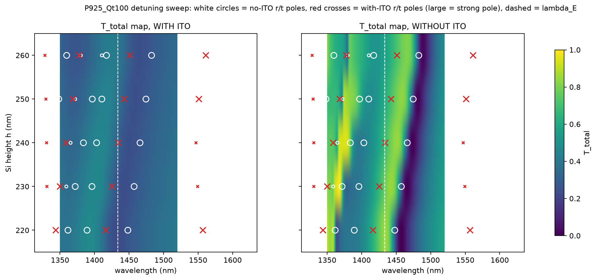
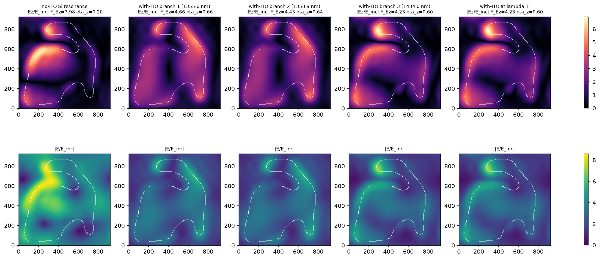

# Stage 17 - P925_Qt100: transmittance with vs without ITO (Karimi Fig. 1(c,d)-style control)

Frozen geometry `enz_highq_driven_ez_audit/outputs/stage16/P925_Qt100/rho_hard_binary.npy` (sha256 9e5c91d4c17cf84c...), P = 925 nm, h = 240 nm, padding 37.0 nm, normal incidence, lab-x polarization, |E_inc| = 1, TORCWA complex128 order [7,7]; T_total/R_total sum all propagating orders (coherent p/s), A = 1 - R - T.  No optimization was performed.

## Numerical checks

- Energy conservation: without ITO max|R+T-1| = 3.2e-10; lossless ITO max|R+T-1| = 1.8e-09; with ITO A in [0.1059, 0.5051], A vs ITO volume integral max diff 1.5e-04 (11 wavelengths).
- Order convergence 1400-1470 nm: with_ITO_9: max|dT| = 0.0130, poles [(1372.2, 12.8), (1432.7, 25.4)]; with_ITO_11: max|dT| = 0.0258, poles [(1430.9, 25.6)]; without_ITO_9: max|dT| = 0.1063, poles [(1381.7, 93.4), (1401.8, 13.3), (1464.3, 58.9)]; without_ITO_11: max|dT| = 0.2139, poles [(1380.3, 90.6), (1401.0, 13.3), (1462.8, 59.5)]
- Sampling: 1 nm broad (1200-1700), 0.25 nm fine (1350-1520), 0.1 nm within +-6 nm of lambda_E (1132 wavelengths per case).

## Values at lambda_E

| case | T_total | T_00 | R_total | A |
|---|---|---|---|---|
| with_ITO | 0.3209 | 0.3209 | 0.1777 | 0.5014 |
| without_ITO | 0.6816 | 0.6816 | 0.3184 | -0.0000 |
| lossless_ITO | 0.0998 | 0.0998 | 0.9002 | -0.0000 |

## Resonances (spectral features) and r/t poles

- **with_ITO** T dips: 1364.8 nm (T 0.328, FWHM 37.8 nm, Q~36.1), 1451.0 nm (T 0.243, FWHM 138.4 nm, Q~10.5)
  poles: 1336.5 nm (Q 36.1, peak r/t 0.10/0.04, r/t diff 6.3e-03, refine ok), 1355.6 nm (Q 13.4, peak r/t 0.73/0.47, r/t diff 1.5e-02), 1358.9 nm (Q 16.9, peak r/t 1.23/0.47, r/t diff 2.0e-03), 1434.0 nm (Q 25.0, peak r/t 0.80/0.38, r/t diff 1.1e-05), 1541.1 nm (Q 6.4, peak r/t 0.33/0.24, r/t diff 7.1e-03), 1552.9 nm (Q 7.1, peak r/t 0.04/0.24, r/t diff 1.7e-02)
- **without_ITO** T dips: 1336.0 nm (T 0.800, FWHM 1.3 nm, Q~992.8), 1345.0 nm (T 0.708, FWHM 7.2 nm, Q~187.7), 1363.8 nm (T 0.607, FWHM 18.0 nm, Q~75.7), 1395.8 nm (T 0.404, FWHM 45.3 nm, Q~30.8), 1474.0 nm (T 0.001, FWHM 36.6 nm, Q~40.3), 1588.0 nm (T 0.584, FWHM 2.3 nm, Q~685.5)
  poles: 1337.1 nm (Q 981.8, peak r/t 0.21/0.09, r/t diff 3.6e-04), 1337.3 nm (Q 288.0, peak r/t 0.04/0.07, r/t diff 6.9e-04), 1338.2 nm (Q 131.4, peak r/t 0.04/0.11, r/t diff 1.3e-03), 1340.4 nm (Q 74.0, peak r/t 0.11/0.15, r/t diff 1.4e-03), 1340.7 nm (Q 56.4, peak r/t 0.11/0.15, r/t diff 3.4e-03), 1341.0 nm (Q 27.6, peak r/t 0.07/0.07, r/t diff 1.1e-02), 1365.0 nm (Q 359.3, peak r/t 0.14/0.20, r/t diff 9.1e-08), 1383.5 nm (Q 94.1, peak r/t 0.38/0.64, r/t diff 2.8e-07), 1402.8 nm (Q 13.3, peak r/t 0.74/0.94, r/t diff 8.7e-05), 1465.8 nm (Q 58.1, peak r/t 1.14/1.11, r/t diff 1.1e-08), 1587.4 nm (Q 1003.8, peak r/t 0.17/0.20, r/t diff 3.4e-08)
- **lossless_ITO** T dips: 1337.0 nm (T 0.312, FWHM 145.9 nm, Q~9.2), 1431.0 nm (T 0.039, FWHM 17.1 nm, Q~83.9), 1459.0 nm (T 0.756, FWHM 0.3 nm, Q~5123.4), 1460.5 nm (T 0.566, FWHM 0.3 nm, Q~4767.1), 1463.8 nm (T 0.442, FWHM 0.3 nm, Q~5439.2), 1467.0 nm (T 0.480, FWHM 0.3 nm, Q~5777.5), 1469.5 nm (T 0.869, FWHM 0.4 nm, Q~3370.0), 1470.5 nm (T 0.720, FWHM 0.2 nm, Q~5981.4), 1472.2 nm (T 0.653, FWHM 0.4 nm, Q~3676.6), 1478.5 nm (T 0.292, FWHM 0.5 nm, Q~3258.9), 1480.0 nm (T 0.078, FWHM 1.1 nm, Q~1331.0), 1482.2 nm (T 0.393, FWHM 0.3 nm, Q~5032.0), 1483.8 nm (T 0.896, FWHM 0.2 nm, Q~6245.5), 1484.8 nm (T 0.651, FWHM 0.2 nm, Q~6612.4), 1487.2 nm (T 0.020, FWHM 1.9 nm, Q~771.4), 1490.0 nm (T 0.141, FWHM 0.5 nm, Q~3276.3), 1490.5 nm (T 0.027, FWHM 2.2 nm, Q~686.3), 1493.2 nm (T 0.298, FWHM 0.3 nm, Q~5021.1), 1494.0 nm (T 0.121, FWHM 1.0 nm, Q~1563.4), 1495.2 nm (T 0.440, FWHM 0.3 nm, Q~4768.0), 1497.8 nm (T 0.580, FWHM 0.5 nm, Q~3024.0), 1498.8 nm (T 0.117, FWHM 0.3 nm, Q~4802.1), 1500.2 nm (T 0.652, FWHM 0.2 nm, Q~6065.2), 1500.8 nm (T 0.692, FWHM 0.5 nm, Q~3151.0), 1501.8 nm (T 0.672, FWHM 0.3 nm, Q~4785.8), 1502.5 nm (T 0.621, FWHM 0.4 nm, Q~4129.0), 1504.5 nm (T 0.281, FWHM 0.6 nm, Q~2486.4), 1505.8 nm (T 0.719, FWHM 0.2 nm, Q~7397.0), 1506.2 nm (T 0.631, FWHM 0.5 nm, Q~3228.8), 1508.5 nm (T 0.765, FWHM 0.5 nm, Q~3245.9), 1509.0 nm (T 0.661, FWHM 0.6 nm, Q~2719.3), 1510.8 nm (T 0.641, FWHM 0.3 nm, Q~5751.7), 1511.5 nm (T 0.674, FWHM 0.5 nm, Q~3222.6), 1513.8 nm (T 0.878, FWHM 0.5 nm, Q~3089.1), 1516.5 nm (T 0.876, FWHM 0.3 nm, Q~6064.2), 1517.2 nm (T 0.224, FWHM 0.3 nm, Q~5709.6), 1522.0 nm (T 0.352, FWHM 1.5 nm, Q~1013.2), 1526.0 nm (T 0.931, FWHM 1.7 nm, Q~907.7), 1530.0 nm (T 0.786, FWHM 1.9 nm, Q~810.0), 1535.0 nm (T 0.741, FWHM 1.7 nm, Q~913.6), 1540.0 nm (T 0.455, FWHM 1.7 nm, Q~927.8), 1543.0 nm (T 0.413, FWHM 1.2 nm, Q~1247.7), 1545.0 nm (T 0.580, FWHM 1.0 nm, Q~1570.7), 1548.0 nm (T 0.153, FWHM 2.5 nm, Q~611.3), 1557.0 nm (T 0.045, FWHM 1.8 nm, Q~847.5), 1559.0 nm (T 0.023, FWHM 21.7 nm, Q~71.9), 1561.0 nm (T 0.065, FWHM 0.9 nm, Q~1810.9), 1564.0 nm (T 0.139, FWHM 2.0 nm, Q~801.2), 1567.0 nm (T 0.029, FWHM 7.4 nm, Q~212.1), 1571.0 nm (T 0.078, FWHM 1.0 nm, Q~1624.1), 1576.0 nm (T 0.099, FWHM 0.9 nm, Q~1741.6), 1578.0 nm (T 0.184, FWHM 1.1 nm, Q~1396.5), 1581.0 nm (T 0.198, FWHM 1.3 nm, Q~1182.0), 1584.0 nm (T 0.070, FWHM 11.8 nm, Q~134.7), 1591.0 nm (T 0.320, FWHM 0.7 nm, Q~2332.4), 1593.0 nm (T 0.396, FWHM 1.8 nm, Q~902.6), 1596.0 nm (T 0.316, FWHM 1.4 nm, Q~1163.0), 1599.0 nm (T 0.308, FWHM 1.9 nm, Q~851.9), 1603.0 nm (T 0.431, FWHM 5.1 nm, Q~313.3), 1607.0 nm (T 0.478, FWHM 0.8 nm, Q~2113.2), 1610.0 nm (T 0.477, FWHM 2.7 nm, Q~595.5), 1617.0 nm (T 0.525, FWHM 2.2 nm, Q~743.4), 1620.0 nm (T 0.555, FWHM 9.1 nm, Q~178.5), 1625.0 nm (T 0.563, FWHM 1.1 nm, Q~1541.1), 1630.0 nm (T 0.587, FWHM 3.5 nm, Q~468.0), 1636.0 nm (T 0.572, FWHM 0.7 nm, Q~2181.4), 1638.0 nm (T 0.555, FWHM 1.4 nm, Q~1130.1), 1645.0 nm (T 0.617, FWHM 1.8 nm, Q~931.5)
  poles: 1335.6 nm (Q 63.4, peak r/t 0.53/0.23, r/t diff 3.0e-03, refine ok), 1335.9 nm (Q 116.5, peak r/t 0.23/0.23, r/t diff 4.4e-03, refine ok), 1361.3 nm (Q 19.6, peak r/t 0.85/0.68, r/t diff 9.2e-05), 1428.0 nm (Q 92.6, peak r/t 1.18/1.03, r/t diff 3.3e-07, refine ok), 1484.3 nm (Q 474.9, peak r/t 0.15/0.11, r/t diff 7.6e-04, refine ok), 1487.4 nm (Q 614.3, peak r/t 1.28/1.35, r/t diff 2.7e-05, refine ok), 1489.8 nm (Q 711.2, peak r/t 1.41/1.28, r/t diff 1.4e-04, refine ok), 1522.7 nm (Q 1151.3, peak r/t 0.36/0.34, r/t diff 3.4e-05, refine NOT converged), 1526.6 nm (Q 1170.4, peak r/t 0.26/0.34, r/t diff 5.1e-03, refine ok), 1548.8 nm (Q 444.7, peak r/t 0.64/0.88, r/t diff 4.2e-04, refine ok), 1558.2 nm (Q 57.2, peak r/t 1.40/1.53, r/t diff 5.7e-03, refine ok), 1566.4 nm (Q 616.3, peak r/t 0.22/0.30, r/t diff 1.1e-03, refine ok), 1568.8 nm (Q 185.0, peak r/t 0.25/0.30, r/t diff 4.1e-03, refine ok), 1600.0 nm (Q 556.2, peak r/t 0.08/0.13, r/t diff 3.7e-03, refine ok)

- Underlying Si resonance without ITO (largest-weight pole in 1350-1520 nm): 1465.8 nm, Q 58.1, FWHM 25.2 nm (3.52 THz)
- With-ITO poles in 1350-1520 nm: [(1355.6, 13.4), (1358.9, 16.9), (1434.0, 25.0)]; lossless-ITO poles: [(1361.3, 19.6), (1428.0, 92.6), (1484.3, 474.9), (1487.4, 614.3), (1489.8, 711.2)]
- Splitting: lower 1355.6 nm (Q 13.4), upper 1434.0 nm (Q 25.0); Delta_lambda = 78.4 nm, Delta_f = 12.09 THz vs no-ITO Si linewidth 25.2 nm (3.52 THz)

## Detuning sweep (h = 220-260 nm)

- h = 220 nm: no-ITO poles [(1327.6, 55.6), (1361.4, 221.5), (1389.1, 14.0), (1447.9, 55.7), (1620.8, 19.7)]; with-ITO poles [(1343.6, 16.7), (1416.0, 26.0), (1556.9, 6.2)]
- h = 230 nm: no-ITO poles [(1333.3, 84.4), (1358.7, 317.5), (1371.6, 144.2), (1395.8, 13.5), (1457.0, 56.8)]; with-ITO poles [(1330.5, 295.9), (1349.7, 16.8), (1425.1, 25.5), (1549.2, 7.1)]
- h = 240 nm: no-ITO poles [(1337.3, 62.7), (1338.9, 92.0), (1365.0, 359.3), (1383.5, 94.1), (1402.9, 13.2), (1465.8, 58.1)]; with-ITO poles [(1330.4, 135.1), (1358.6, 16.6), (1434.0, 25.0), (1546.7, 7.0)]
- h = 250 nm: no-ITO poles [(1338.1, 284.1), (1348.1, 42.3), (1371.9, 396.9), (1396.5, 62.5), (1410.1, 13.3), (1474.3, 59.6)]; with-ITO poles [(1329.5, 118.0), (1368.2, 16.1), (1442.6, 24.5), (1551.0, 6.9)]
- h = 260 nm: no-ITO poles [(1359.5, 32.9), (1379.7, 397.1), (1410.2, 41.5), (1417.0, 13.8), (1482.6, 61.4)]; with-ITO poles [(1328.1, 130.7), (1377.4, 15.2), (1450.9, 24.1), (1560.9, 6.9)]

## Field metrics at the branches

| branch | case | lambda | F_Ez | F_Etot | eta_z | A | ITO E-energy fraction | eta_ENZ,z |
|---|---|---|---|---|---|---|---|---|
| no-ITO Si resonance | without_ITO | 1465.8 | 3.98 | 20.14 | 0.20 | n/a | n/a | n/a |
| with-ITO branch 1 (1355.6 nm) | with_ITO | 1355.6 | 4.66 | 7.11 | 0.66 | 0.451 | 0.246 | 0.0500 |
| with-ITO branch 2 (1358.9 nm) | with_ITO | 1358.9 | 4.43 | 6.91 | 0.64 | 0.440 | 0.240 | 0.0472 |
| with-ITO branch 3 (1434.0 nm) | with_ITO | 1434.0 | 4.23 | 7.10 | 0.60 | 0.502 | 0.202 | 0.0345 |
| with-ITO at lambda_E | with_ITO | 1433.5 | 4.23 | 7.09 | 0.60 | 0.501 | 0.202 | 0.0345 |

## Figures

A `P925_Qt100_transmittance_with_vs_without_ITO.png`, B `P925_Qt100_transmittance_ENZ_zoom.png`, C `P925_Qt100_T_R_A_with_ITO.png`, D `P925_Qt100_Ttotal_vs_T00.png`, E `P925_Qt100_anticrossing_map.png`, F `P925_Qt100_hybrid_field_maps.png`; data: `spectrum_*.csv`, `conv_*.csv`, `sweep_*.csv`, `resonances_and_poles.json`, `detuning_trajectories.json`, `field_metrics.json`, `A_volume_crosscheck.csv`.

## Interpretation

1. **No-ITO spectrum.** Broad 1200-1700 nm: high transmission (0.7-0.95) except for silicon resonances. In the
   ENZ region there is one dominant, deep and narrow dip at 1474 nm (T_total -> 0.001; pole 1465.8 nm,
   Q 58.1, strong in both r and t), a shallower dip at 1396 nm (pole 1402.9 nm, Q 13.2) and a narrow feature
   near 1364 nm (order-sensitive). At lambda_E the bare structure is transparent: T = 0.68, R = 0.32.
2. **Underlying Si photonic resonance.** 1465.8 nm, Q 58.1, FWHM 25.2 nm = 3.52 THz (certified r/t pole,
   converged to 1462.8 nm at [11,11]). It lies 32 nm to the red of lambda_E.
3. **What the 23-nm ITO changes.** (i) The 1466-nm Si resonance moves to 1434.0 nm (-31.9 nm, +4.5 THz) and its
   Q drops from 58 to 25 (the Stage-16 certification of this pole gives Q_rad 86, Q_nr 34). (ii) The deep
   no-ITO dip (T 0.001) becomes a shallow asymmetric dip (T minimum 0.24 at 1451 nm; A maximum 0.505 at
   1437.6 nm); at lambda_E: T 0.68 -> 0.32, R 0.32 -> 0.18, A 0 -> 0.50. (iii) The second Si mode (1403 nm,
   Q 13) moves to 1356-1359 nm (Q 13-17). (iv) The lossless-ITO control shows the same resonance at 1428 nm
   with Q 93 and T 0.05: the wavelength shift is a dispersive (Re eps_ITO ~ 0) loading effect, the Q
   reduction 93 -> 25 is ITO absorption. The lossless control also exposes a comb of very narrow poles at
   1484-1600 nm (Q 400-1200; ITO-guided/lattice states) that are invisible with the real loss.
4. **Shift, broaden, split, or hybridize?** The resonance SHIFTS (-32 nm) and BROADENS (Q 58 -> 25). It does
   not split: the with-ITO structure has one pole in the 1400-1520 nm window at every height. The two
   with-ITO poles at 1356 and 1434 nm are the ITO-shifted images of two different Si modes (no-ITO 1403 and
   1466 nm), not two hybrid branches of one mode.
5. **Anticrossing.** No. Over h = 220-260 nm the Si pole moves 1447.9 -> 1482.6 nm (+8.7 nm per 10 nm) and
   the with-ITO pole moves 1416.0 -> 1450.9 nm at the same rate with a constant offset of -31.8 +- 0.1 nm and
   nearly constant Q (26.0 -> 24.1); the lower with-ITO pole likewise tracks the 1389 -> 1417 nm Si mode with
   a -40 to -46 nm offset. Nothing is pinned near lambda_E, no gap opens when the shifted resonance crosses
   lambda_E (h ~ 240 nm), and no ENZ-anchored branch appears in the with-ITO map. Caveat: the sweep moves the
   Si resonance by only +-17 nm; a weak avoided crossing with a gap below the pole linewidth (~57 nm FWHM with
   ITO) could not be resolved, but any such gap would be far below the strong-coupling criterion.
6. **Splitting numbers.** Between the two with-ITO poles: Delta_lambda = 78.4 nm, Delta_f = 12.1 THz, larger
   than the no-ITO Si linewidth (3.5 THz) - but this pair does not originate from one mode (item 4), so it is
   not a Rabi splitting. Within the 1466-nm mode itself the splitting is zero.
7. **Longitudinal Ez.** With-ITO 1434-nm branch at its pole: F_Ez 4.23, eta_z 0.60, ITO electric-energy
   fraction 0.20, eta_ENZ,z 0.035, peak |Ez|^2 55. The lower 1356/1359-nm poles: F_Ez 4.66/4.43, eta_z
   0.66/0.64, ITO E-fraction 0.25/0.24 - slightly stronger and more longitudinal. Without ITO, the glass slab at
   the ITO position at the Si resonance has F_Ez 3.98 but eta_z only 0.20: the ITO's small |eps| converts
   the resonant field into a predominantly longitudinal one (D_z continuity) without a large change of the Ez
   magnitude.
8. **Origin of F_Ez = 4.228.** A single ITO-loaded silicon photonic resonance: the 1466-nm Si mode, shifted to
   1434 nm by the ITO's real permittivity and broadened by its absorption, driven at its own pole. It is not
   a Mie/Si-ENZ hybrid doublet; the ITO enters as a perturbative dispersive-absorptive load that carries ~20 %
   of the electric energy and makes the ITO field longitudinal (eta_z 0.6).
9. **Resemblance to Karimi et al. Fig. 1-2.** Partial. Shared: adding the ITO blue-shifts and broadens the
   silicon dip, and the with-ITO dip is shallow where the bare dip was deep. Not shared: Karimi report two
   dips (upper/lower branches) and an avoided crossing versus antenna size; here there is one dip that
   follows the Si mode with a constant offset and no second branch. P925_Qt100 is therefore in the
   weak-coupling / perturbative-loading regime with respect to the ENZ film (whose own resonance is broad,
   Q ~ 5.8), consistent with the Stage 2-9 conclusion that its strong response is an ITO-loaded Si resonance.
