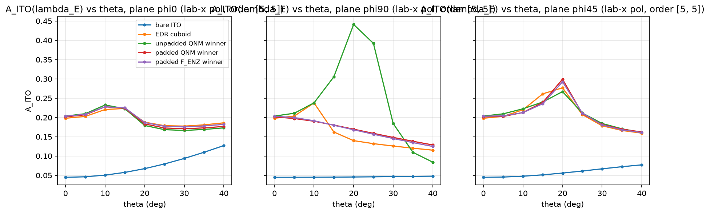

# PREFLIGHT - robust ENZ energy-transfer inverse design

Generated by `preflight.py` (reproducible; all numbers in `outputs/preflight.json`).

## Stage 0 - ingest audit

- lambda_E = 1433.488 nm. Origin: Re(omega) of the bare air/ITO(23)/glass TM QNM at K = G10(850 nm): omega = 1.314034-0.113306i rad/fs, Q = 5.799; inherited from the frozen 850-nm benchmark and held FIXED for all periods in this campaign (task statement).
- eps_ITO(lambda_E) from the measured CSV = -0.0742 + 0.7014i (target npz: -0.0742 + 0.7014i); material ENZ crossing 1419.59 nm; d_ITO = 23.0 nm; n_glass = 1.4446.
- eps_aSi(lambda_E) (POSTECH measured file) = 8.7917 (n = 2.9651, k = 0).
- Reference structures (frozen, read-only):

| reference | source | fill | S_flip(lr) | S_flip(ud) |
|---|---|---|---|---|
| bare ITO | `air/ITO(23)/glass, no a-Si` | 0.000 | 0.000 | 0.000 |
| EDR cuboid | `560x500x140 nm cuboid, 850 cell` | 0.390 | 0.000 | 0.000 |
| unpadded QNM winner | `enz_inverse_design/outputs/geometries/rho_hard_binary.npy` | 0.594 | 0.000 | 1.000 |
| padded QNM winner | `enz_padding_sideexperiment/outputs/geometries/rho_hard_binary.npy` | 0.495 | 0.141 | 0.273 |
| padded F_ENZ winner | `enz_direct_enz_excitation/outputs/geometries/rho_hard_binary.npy` | 0.488 | 0.150 | 0.248 |

## Stage 1a - symmetry preflight

**Both historical Example6 fliplr symmetry projections were disabled in the new inverse-design path; no mirror symmetry is enforced.** (`optimizer.py`; the upstream notebook and `enz_inverse_design/optimize_enz_overlap.py` are untouched.)

- S_flip of the raw seed-333 random init: 0.708
- after the historical projection `(rho+fliplr(rho))/2`: 0.0e+00 (=0, symmetric)
- new path (mask + filter, no projection): 0.052 (lr), 0.071 (ud)
- optimizer smoke run (2 iterations, tiny problem): S_flip init 0.227 -> final 0.697

## Stage 1b - energy conservation and diffraction-order audit

- 60 lossless (no-ITO) cases, P in {750, 850, 1050, 1300} nm, theta up to 40 deg, conical azimuths, lab-x / p / s inputs, ALL orders summed in TORCWA's p/s basis: worst |R+T-1| = 2.0e-14; the number of propagating orders reported by TORCWA equals the analytic count in glass in every case (higher orders propagate in glass for P > lambda_E/n_glass = 992 nm and at oblique incidence).

## Stage 1c - A_ITO identity at oblique incidence

| reference | P | theta | phi | A = 1-R-T | volume integral | R | T | F_Ez | eta_z | x-pol frac R00 / T00 |
|---|---|---|---|---|---|---|---|---|---|---|
| EDR cuboid | 850 | 0 | 0 | 0.19873 | 0.19870 | 0.1406 | 0.6607 | 2.148 | 0.765 | 0.000 / 0.000 |
| EDR cuboid | 850 | 20 | 0 | 0.18866 | 0.18863 | 0.0962 | 0.7152 | 1.898 | 0.757 | 0.000 / 0.000 |
| EDR cuboid | 850 | 20 | 90 | 0.14081 | 0.14079 | 0.1087 | 0.7505 | 1.105 | 0.591 | 0.000 / 0.000 |
| EDR cuboid | 1050 | 25 | 45 | 0.14721 | 0.14719 | 0.1653 | 0.6875 | 1.205 | 0.639 | 0.866 / 0.014 |
| padded QNM winner | 850 | 0 | 0 | 0.20095 | 0.20092 | 0.1390 | 0.6600 | 2.214 | 0.779 | 0.000 / 0.000 |
| padded QNM winner | 850 | 20 | 0 | 0.18280 | 0.18278 | 0.0906 | 0.7266 | 1.840 | 0.758 | 0.000 / 0.000 |
| padded QNM winner | 850 | 20 | 90 | 0.16963 | 0.16961 | 0.1903 | 0.6401 | 1.563 | 0.693 | 0.000 / 0.000 |
| padded QNM winner | 1050 | 25 | 45 | 0.15606 | 0.15604 | 0.1893 | 0.6546 | 1.205 | 0.602 | 0.789 / 0.027 |

P_inc = 0.5 cos(theta) P^2 |E_inc|^2 with |E_inc| = 1 (p/s-notation source). Polarization conversion (TE/TM mixing) is included in R_total/T_total through the coherent p/s combination.

## Stage 1d - gradient check

- pixel [10, 3]: autograd +4.822964e-05, central FD +4.822964e-05, rel. err 3.4e-08
- pixel [16, 10]: autograd +2.323679e-03, central FD +2.323679e-03, rel. err 3.7e-10
- pixel [25, 3]: autograd -1.126275e-04, central FD -1.126275e-04, rel. err 1.1e-07
- pixel [19, 16]: autograd +2.395511e-03, central FD +2.395511e-03, rel. err 5.8e-09

## Stage 1e - order convergence of A (padded QNM winner)

| theta | phi | [5,5] | [7,7] | [9,9] |
|---|---|---|---|---|
| 0 | 0 | 0.2015 | 0.2009 | 0.2027 |
| 20 | 0 | 0.1832 | 0.1828 | 0.1841 |
| 20 | 90 | 0.1696 | 0.1696 | 0.1718 |

## Stage 1f/1h - timing and run sizing

- {"[5, 5]": 0.299727201461792, "[7, 7]": 1.3960838317871094} s per angle (fwd+bwd, 128x128, 4 threads)
- {"s_per_iter_screen": 0.899181604385376, "n_runs_stage2": 216, "n_iter_stage2": 100, "est_stage2_h": 5.395089626312256, "s_per_iter_full": 8.376502990722656, "n_iter_stage4": 150, "est_stage4_h": 1.3960838317871094}

## Stage 1g - angular domain and beta calibration

- Authority: NONE found in repo (grep for NA / numerical aperture / acceptance angle / high-NA over *.md,*.py,*.txt,*.csv,*.json).
- ASSUMPTION: modest +-30 deg cone (NA~0.5 in air), lab-frame x polarization projected on the transverse plane; uniform weights; screen set 3 angles, full set 5 angles; final check on the phi=0, 90, 45 deg planes 0-40 deg.
- screen set [(0.0, 0.0), (20.0, 0.0), (20.0, 90.0)]; full set [(0.0, 0.0), (15.0, 0.0), (30.0, 0.0), (15.0, 90.0), (30.0, 90.0), (20.0, 45.0)].
- beta rule: ln(10)/median_reference_angular_spread; reference spreads {"EDR cuboid": 0.149, "unpadded QNM winner": 0.1421, "padded QNM winner": 0.1478, "padded F_ENZ winner": 0.144}; median 0.1459 -> **beta = 15.79** (clip (5.0, 200.0)).

| reference | A(FULL set) | J_robust | min A | mean A |
|---|---|---|---|---|
| bare ITO | [0.0449, 0.0577, 0.0938, 0.0454, 0.0468, 0.0559] | 0.0554 | 0.0449 | 0.0574 |
| EDR cuboid | [0.1987, 0.224, 0.1786, 0.1629, 0.127, 0.276] | 0.1789 | 0.1270 | 0.1945 |
| unpadded QNM winner | [0.205, 0.2229, 0.1664, 0.3085, 0.1848, 0.2674] | 0.2101 | 0.1664 | 0.2258 |
| padded QNM winner | [0.2009, 0.2233, 0.1705, 0.1803, 0.1484, 0.2961] | 0.1892 | 0.1484 | 0.2032 |
| padded F_ENZ winner | [0.2079, 0.2289, 0.1783, 0.185, 0.15, 0.294] | 0.1938 | 0.1500 | 0.2073 |

