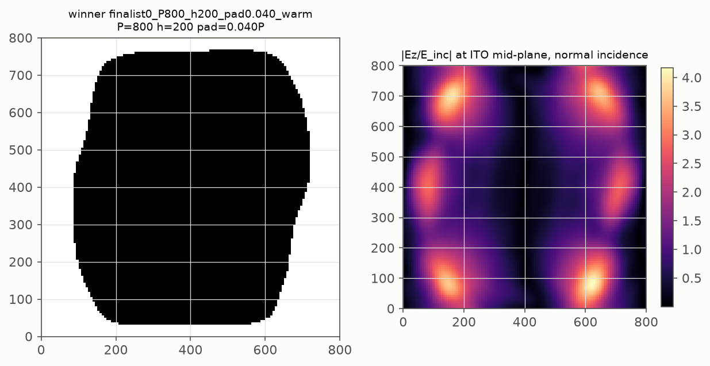
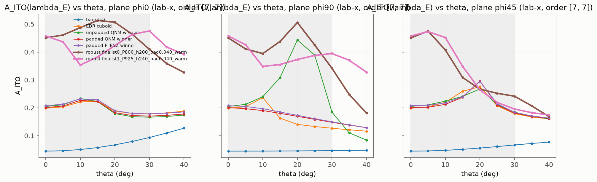

# ROBUST ENZ ENERGY-TRANSFER FREEFORM INVERSE DESIGN - REPORT

Generated by `stage5_posthoc.py`; all numbers in `outputs/*/*.json|csv`.

## 0. Symmetry statement

**Both historical Example6 fliplr symmetry projections were disabled in the new inverse-design path; no mirror symmetry is enforced.** Winner S_flip(lr) = 0.323, S_flip(ud) = 0.318 (0 would be mirror-symmetric). The upstream notebook and the frozen campaigns are untouched.

## 1. Objective and search

- Loss: J_robust = -(1/beta) log sum_m w_m exp(-beta A_m), A_m = 1 - R_total - T_total (ALL propagating orders, coherent p/s combination of the lab-x polarization) at lambda_E = 1433.488 nm; beta = 15.79 calibrated from the reference angular spreads (median 0.1459); uniform weights.
- No Q, Ez, harmonic, QNM-overlap, multipole, Kerker, BIC, polariton or critical-coupling term in the loss.
- Angular domain: modest +-30 deg cone (NA~0.5 in air), lab-frame x polarization projected on the transverse plane; uniform weights; screen set 3 angles, full set 5 angles; final check on the phi=0, 90, 45 deg planes 0-40 deg (ASSUMPTION - NONE found in repo (grep for NA / numerical aperture / acceptance angle / high-NA over *.md,*.py,*.txt,*.csv,*.json)).
- Design variables: rho(x,y) on 128x128, P in [700.0, 775.0, 850.0, 925.0, 1000.0, 1075.0] (refined +-50 nm), h in [120.0, 140.0, 160.0, 200.0] (+-20), p_pad in [0.04, 0.08, 0.12] (+-0.03, always > 0); ITO stack and lambda_E fixed.
- Stage 2: 216 shortened runs (100 it, order [5, 5], angles [(0.0, 0.0), (20.0, 0.0), (20.0, 90.0)]); top: P=925 h=200 pad=0.04 J=0.4678; P=850 h=200 pad=0.04 J=0.4154; P=925 h=200 pad=0.08 J=0.3824; P=925 h=160 pad=0.04 J=0.3787; P=925 h=200 pad=0.12 J=0.3699
- Stage 3: adaptive neighbourhood refinement (120 it, warm-started); finalists: P=800 h=200 pad=0.040 J=0.5479; P=925 h=240 pad=0.040 J=0.5338; P=925 h=220 pad=0.040 J=0.5143
- Stage 4: full runs (order [7, 7], angles [(0.0, 0.0), (15.0, 0.0), (30.0, 0.0), (15.0, 90.0), (30.0, 90.0), (20.0, 45.0)], 150 it): warm-started finalists + one from-scratch run (seed 2024):

| run | P | h | pad | J_hard | A(FULL set) | dense<=30 min / mean | S_flip | warm |
|---|---|---|---|---|---|---|---|---|
| finalist0_P800_h200_pad0.040_warm | 800 | 200 | 0.040 | 0.3525 | [0.45067185883989147, 0.5132482541440571, 0.409835412474482, 0.4381149920840347, 0.3419021804643765, 0.2669160844118361] | 0.2417 / 0.4125 | 0.323 | True |
| finalist1_P925_h240_pad0.040_warm | 925 | 240 | 0.040 | 0.3479 | [0.45739515914468, 0.38231911751014497, 0.4757083864355365, 0.35530645298472496, 0.39472925371497913, 0.26433852547568604] | 0.1959 / 0.3879 | 0.891 | True |
| finalist2_P925_h220_pad0.040_warm | 925 | 220 | 0.040 | 0.3154 | [0.4387206549745504, 0.4794394399441111, 0.49514081739608307, 0.3488179445584202, 0.39199381096651215, 0.21556858271232093] | 0.1781 / 0.3882 | 0.917 | True |
| scratch_P800_h200_pad0.040_seed2024 | 800 | 200 | 0.040 | 0.2236 | [0.23208296602153478, 0.32579027327090515, 0.19617744820697625, 0.3549616622208248, 0.1523098347297107, 0.33462171901059523] | 0.1523 / 0.2526 | 0.690 | False |
| scratch_P800_h200_pad0.040_seed4096 | 800 | 200 | 0.040 | 0.2109 | [0.21735481383787325, 0.2576750614389889, 0.20399569015444186, 0.3258080871545117, 0.14152242258692815, 0.27801599118844533] | 0.1415 / 0.2313 | 0.552 | False |

**Winner: finalist0_P800_h200_pad0.040_warm** - P = 800 nm, h = 200 nm, p_pad = 0.040 P (realized 31.2 nm), fill (active) = 0.753.

## 2. High-accuracy refinement

| candidate | order | J | A(FULL set) |
|---|---|---|---|
| finalist0_P800_h200_pad0.040_warm | [7, 7] | 0.35252 | [0.4507, 0.5132, 0.4098, 0.4381, 0.3419, 0.2669] |
| finalist0_P800_h200_pad0.040_warm | [9, 9] | 0.35236 | [0.4607, 0.515, 0.3974, 0.4989, 0.3028, 0.2835] |
| finalist0_P800_h200_pad0.040_warm | [11, 11] | 0.35012 | [0.4664, 0.517, 0.3927, 0.524, 0.2858, 0.2938] |
| finalist1_P925_h240_pad0.040_warm | [7, 7] | 0.34792 | [0.4574, 0.3823, 0.4757, 0.3553, 0.3947, 0.2643] |
| finalist1_P925_h240_pad0.040_warm | [9, 9] | 0.34780 | [0.4661, 0.3877, 0.477, 0.3571, 0.391, 0.263] |
| finalist1_P925_h240_pad0.040_warm | [11, 11] | 0.34806 | [0.4725, 0.3935, 0.4778, 0.3596, 0.3886, 0.2621] |

## 3. Final comparison (same angular sets, same order, lab-x polarization)

| structure | P | h | J_robust | A(0 deg) | min A (FULL) | mean A (FULL) | dense<=30 min | dense<=30 mean | F_Ez(0) | eta_z(0) |
|---|---|---|---|---|---|---|---|---|---|---|
| bare ITO | 850 | 140 | 0.0554 | 0.0449 | 0.0449 | 0.0574 | 0.0449 | 0.0539 | 0.000 | 0.000 |
| EDR cuboid | 850 | 140 | 0.1789 | 0.1987 | 0.1270 | 0.1945 | 0.1270 | 0.1972 | 2.148 | 0.765 |
| unpadded QNM winner | 850 | 140 | 0.2101 | 0.2050 | 0.1664 | 0.2258 | 0.1664 | 0.2340 | 2.321 | 0.801 |
| padded QNM winner | 850 | 140 | 0.1892 | 0.2009 | 0.1484 | 0.2032 | 0.1484 | 0.1985 | 2.214 | 0.779 |
| padded F_ENZ winner | 850 | 140 | 0.1938 | 0.2079 | 0.1500 | 0.2073 | 0.1500 | 0.2037 | 2.285 | 0.778 |
| robust finalist0_P800_h200_pad0.040_warm | 800 | 200 | 0.3525 | 0.4507 | 0.2669 | 0.4034 | 0.2417 | 0.4125 | 2.152 | 0.338 |
| robust finalist1_P925_h240_pad0.040_warm | 925 | 240 | 0.3479 | 0.4574 | 0.2643 | 0.3883 | 0.1959 | 0.3879 | 4.031 | 0.623 |

## 4. Post-hoc physics of the winner (diagnostic only)

- Spectra (with ITO 0/20 deg, no ITO, lossless ITO, bare ITO): `outputs/figures/stage5_spectra.png`. Weak resonance gate (reported only): {"A_E": 0.45067185883989147, "C80": 0.6005090317189491, "center_dominant": true, "note": "reported only; not used in any loss"}.
- r/t poles with ITO (channel-agnostic AAA, window (1309.911448275862, 1557.064551724138)): {'lambda_pole_nm': 1487.6027946988957, 'Q_pole': 5.225632603658486, 'rt_rel_diff': 0.005691890788147137, 'stability_rel': 0.0037435085759617405, 'stable': True, 'res_r_norm': np.float64(1.0), 'res_t_norm': np.float64(1.0), 'peak_r': np.float64(0.2075226778511007), 'peak_t': np.float64(0.0942456079105699)}; all certified in-window: [{'lambda_nm': 1491.674850665006, 'Q': 5.166884292625343, 'peak_r': np.float64(0.2075226778511007), 'peak_t': np.float64(0.0942456079105699)}, {'lambda_nm': 1437.5568175384733, 'Q': 73.81231074306238, 'peak_r': np.float64(0.6938176754544055), 'peak_t': np.float64(0.3489040335519766)}]; no-ITO photonic poles: None / [].
- Loss-scaling decomposition: Q_loaded = 5.51, Q_rad = 50.1, Q_nr = 5.96, gamma_rad/gamma_nr = 0.119 (critical-coupling indicator, two-port caveat), glass fraction of gamma_rad ~ 0.75 (air 0.25); linearity residual 5.52e-02.
- F_Ez / eta_z / propagating orders per FULL angle: (0_0) A=0.4507 F_Ez=2.153 eta_z=0.338 orders=[(0, 0)]; (15_0) A=0.5132 F_Ez=2.491 eta_z=0.355 orders=[(0, 0)]; (30_0) A=0.4098 F_Ez=1.805 eta_z=0.360 orders=[(-1, 0), (0, 0)]; (15_90) A=0.4381 F_Ez=4.006 eta_z=0.669 orders=[(0, 0)]; (30_90) A=0.3419 F_Ez=2.742 eta_z=0.655 orders=[(0, -1), (0, 0)]; (20_45) A=0.2669 F_Ez=2.681 eta_z=0.756 orders=[(0, 0)]
- Fourier energy fractions of Ez in the ITO (normal incidence, G10/k0 = 1.792, K_ENZ/k0 = 1.687): {"(-2,-1)": 0.028, "(-2,1)": 0.019, "(-1,-1)": 0.089, "(-1,0)": 0.219, "(-1,1)": 0.062, "(1,-1)": 0.07, "(1,0)": 0.219, "(1,1)": 0.079, "(2,-1)": 0.022, "(2,1)": 0.022}
- Multipoles (a-Si current, free-space formulas, approximate): ED 0.336, MD 0.048, EQ 0.006, MQ 0.611.
- Locality: {"n_components": 1, "largest_component_frac": 1.0, "min_feature_nm": 143.75, "min_gap_nm": 31.25, "fill": 0.63970947265625, "S_flip_lr": 0.3230779365960491, "S_flip_ud": 0.3183177804194587}.
- Fabrication robustness (uniform dilate/erode, J at FULL set): {"-2px (-12.5 nm)": 0.2399, "-1px (-6.2 nm)": 0.277, "+1px (+6.2 nm)": 0.2539, "+2px (+12.5 nm)": 0.2097}
- Pulse-aware validation: skipped: no documented pulse spectrum exists in the repository (searched *.md/*.txt/*.py/*.csv/*.json for pulse/bandwidth/fs).

## 5. Honesty ledger

- lambda_E is inherited from the 850-nm bare-film QNM anchor and held fixed for every period; the loaded resonance of each design is certified post hoc.
- The angular set and the uniform weights are assumptions (no authoritative NA in the repo).
- Stage 2/3 use order [5,5] and 3 angles (screen); Stage 4/5 use [7,7]/[9,9]/[11,11] and 5 angles; dense checks on 3 planes.
- The multipole fractions use free-space formulas; the periodic glass/ITO environment makes them indicative only.
- Historical padded references have S_flip ~ 0.14-0.15 (not exactly 0) because the Example6 projection symmetrized the raw variable while the half-pixel-offset blur kernel and hard threshold broke exact symmetry; the new path enforces nothing.